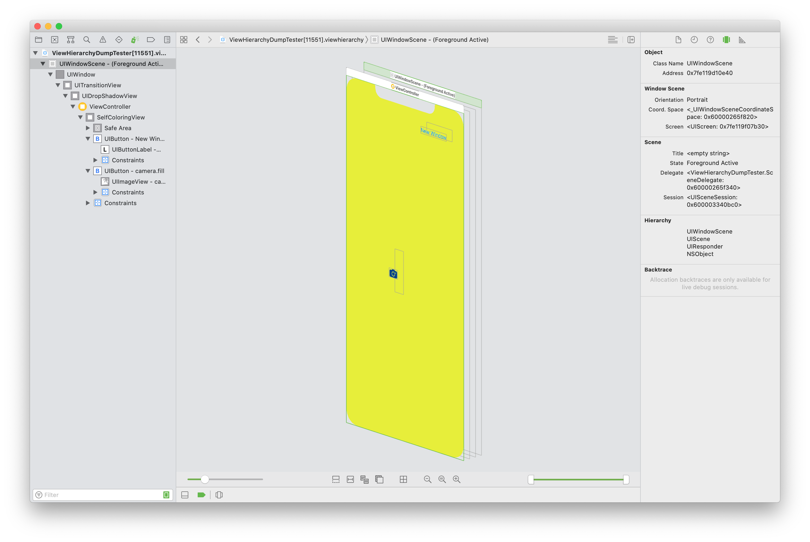

# LNViewHierarchyDumper

A framework for programmatically dumping the view hierarchy of your app into an Xcode 16 and above compatible view hierarchy file archive.

[](https://github.com/LeoNatan/LNViewHierarchyDumper/releases) [](https://github.com/LeoNatan/LNViewHierarchyDumper/stargazers) [](https://raw.githubusercontent.com/LeoNatan/LNViewHierarchyDumper/master/LICENSE) <span class="badge-paypal"><a href="https://www.paypal.com/cgi-bin/webscr?cmd=_s-xclick&hosted_button_id=BR68NJEJXGWL6" title="Donate to this project using PayPal"></a></span>

[](https://github.com/LeoNatan/LNViewHierarchyDumper/issues) [](https://github.com/LeoNatan/LNViewHierarchyDumper/graphs/contributors) 

<p align="center"></p>

The framework supports dumping the view hierarchy of apps running on iOS, tvOS and watchOS simulators, hardware devices **with developer image mounted**, and macOS and Catalyst **with Xcode installed**. Under unsupported targets or environments, the frameworks fails silently and returns an error.

**This framework uses Xcode's internal DebugHierarchyFoundation framework, and is not AppStore safe**, thus you should use with care, only linking against it in development/testing scenarios/builds. Since the framework requires developer tooling (developer image mounted on iOS hardware; Xcode on macOS), there would be little benefit from having this framework in production anyway.

Deploying the framework conditionally is a complex topic, beyond the scope of this README. One strategy can be to link the dynamic library with UI testing project, and launch your app with the `DYLD_INSERT_LIBRARIES` environment variable, pointing to the LNViewHierarchyDumper framework.

Using the framework is very easy:

```swift
import LNViewHierarchyDumper

//...

let url = //URL to a directory
try LNViewHierarchyDumper.shared.dumpViewHierarchy(to: url)
```

